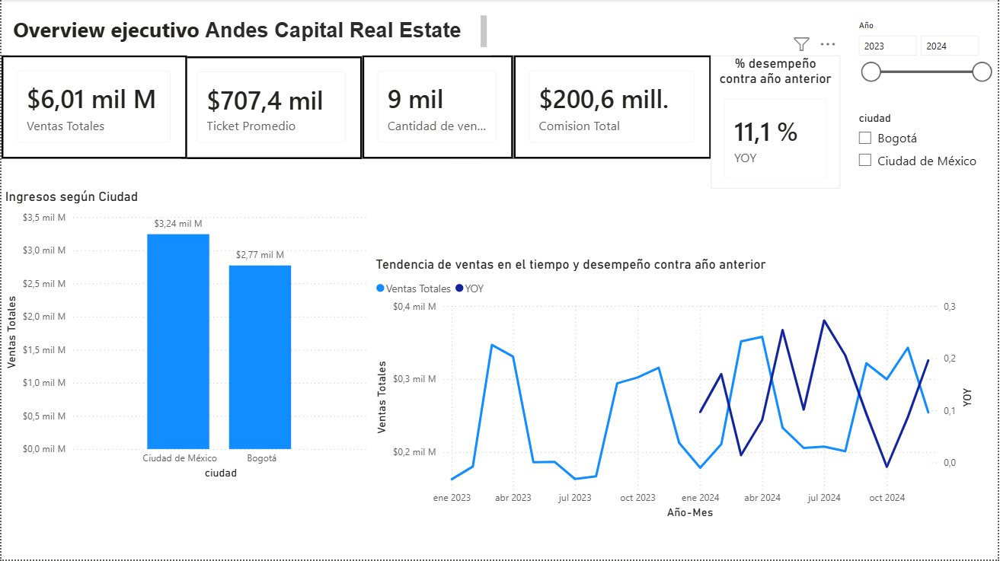
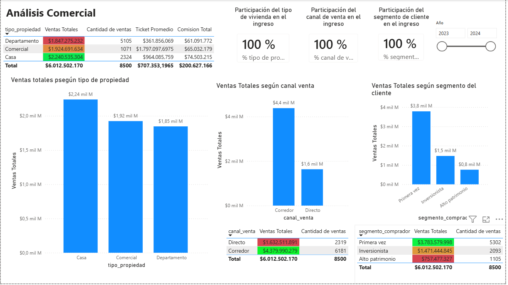
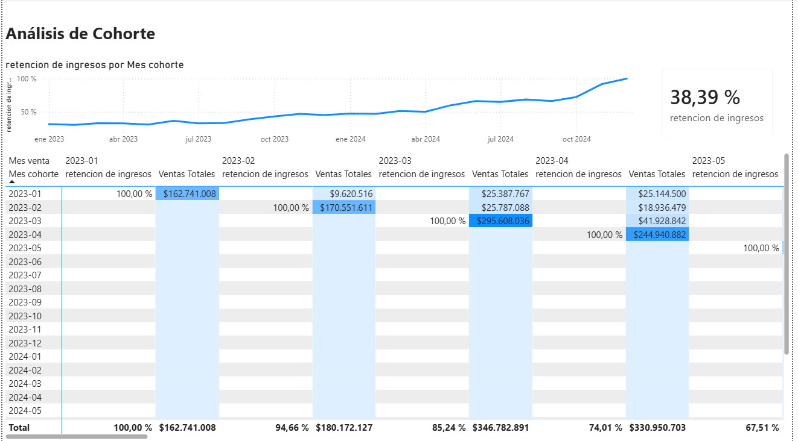

🏢 Análisis Comercial Inmobiliario | Andes Capital Real Estate

📌 Descripción del proyecto

Proyecto de análisis comercial inmobiliario desarrollado en Power BI para Andes Capital Real Estate, a partir de información transaccional de ventas, clientes y propiedades.

El proyecto busca transformar los datos comerciales en información útil para analizar el desempeño del negocio, identificar patrones de compra y evaluar la recurrencia de clientes.

Para el análisis se construyó un modelo de datos en esquema estrella, una tabla calendario y medidas DAX orientadas al análisis comercial y temporal.

🎯 Objetivo

Construir una solución analítica que permita responder preguntas como:

¿Cuál es el ingreso total generado por las ventas?

¿Qué tipos de propiedades generan mayores ingresos?

¿Qué segmentos de clientes tienen mayor participación?

¿Cómo evolucionan las ventas a través del tiempo?

¿Cómo se comporta el negocio respecto al año anterior?

¿Los clientes vuelven a comprar después de su primera adquisición?

¿Cómo evoluciona la retención de clientes mediante cohortes?

🛠️ Herramientas y competencias

Power BI

Power Query

DAX

Modelado dimensional

Esquema estrella

Inteligencia de tiempo

Análisis de cohortes

Git / GitHub

🗃️ Modelo de datos

El modelo fue construido utilizando una tabla de hechos y tablas dimensionales:

hecho_ventas_propiedades: transacciones de ventas.

dim_clientes: información y segmentación de clientes.

dim_propiedades: características de las propiedades.

Dim_Fecha: tabla calendario creada para realizar análisis temporal.

Las relaciones fueron configuradas siguiendo un esquema estrella, con relaciones uno a muchos y dirección de filtro simple.

🧮 Medidas y análisis

Se desarrollaron medidas DAX para evaluar diferentes dimensiones del negocio, entre ellas:

Ventas Totales

Cantidad de Ventas

Ticket Promedio

Comisión Total

Participación por tipo de propiedad

Participación por canal de venta

Participación por segmento

Ventas YTD

Ventas MTD

Ventas Año Anterior

Crecimiento YoY

Métricas de retención para análisis de cohortes

Para los cálculos se utilizaron funciones como DIVIDE, CALCULATE, ALL y SAMEPERIODLASTYEAR.

📊 Dashboard

El reporte fue organizado en tres páginas con distintos niveles de análisis.

1. Overview ejecutivo

Presenta los principales indicadores del negocio, la evolución temporal de las ventas, desempeño geográfico y comparación respecto al año anterior.



2. Análisis comercial

Profundiza en el desempeño según tipo de propiedad, canal de venta y segmento de comprador, incorporando métricas de participación para identificar qué componentes tienen mayor peso dentro del negocio.



3. Análisis de cohortes

Analiza el comportamiento de los clientes a partir del mes de su primera compra y permite observar su recurrencia y retención a través del tiempo.



🔎 Principales hallazgos

El análisis permitió identificar patrones relevantes para el desempeño comercial:

Casa se posiciona como el tipo de propiedad con mayor aporte comercial.

Ciudad de México presenta el mayor nivel de ingresos dentro del análisis geográfico.

El canal Corredor destaca por su participación en las ventas.

El segmento Primera Vez presenta una participación relevante dentro de los compradores.

El análisis temporal permite comparar el desempeño del negocio entre períodos y evaluar su evolución interanual.

El análisis de cohortes permite estudiar la recurrencia de los clientes después de su primera compra.

📈 Crecimiento interanual

La comparación de 2024 frente a 2023 muestra un crecimiento YoY de aproximadamente 11,14 %.

La métrica se evalúa dentro del contexto del año correspondiente para realizar correctamente la comparación con el período anterior.

📂 Estructura del repositorio
```text
├── dashboard/
│   └── Andes_Capital_Analisis_Comercial.pbix
│
├── data/
│   ├── hecho_ventas_propiedades
│   ├── dim_clientes
│   └── dim_propiedades
│
├── images/
│   ├── dashboard_overview.png
│   ├── analisis_comercial.png
│   └── analisis_cohortes.png
│
└── README.md
```
🚀 Próximas mejoras

Este proyecto continuará evolucionando mediante nuevos análisis orientados a profundizar la comprensión comercial del negocio.

Entre las posibles líneas de desarrollo se encuentran:

profundizar el análisis de rentabilidad y comisiones;

estudiar diferencias comerciales entre ciudades y tipos de propiedad;

ampliar el análisis del desempeño de los canales de venta;

profundizar el análisis de recurrencia y retención de clientes;

incorporar nuevos indicadores comerciales;

desarrollar nuevas preguntas de negocio a partir de los resultados obtenidos.
